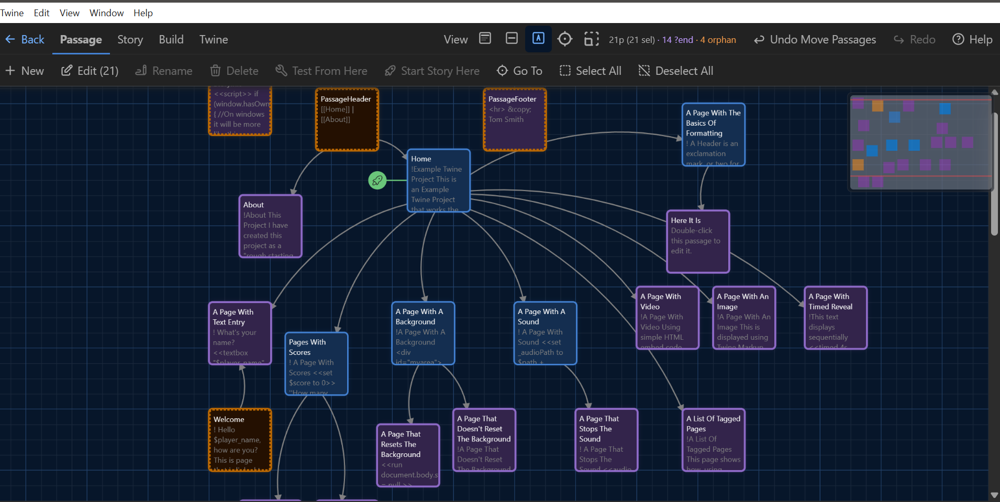

# TwineJS Modified (Unofficial)

This repository is an **unofficial modified fork** of **TwineJS** (Twine 2), originally by Chris Klimas and contributors.

I made this fork because, personally, I felt TwineJS could use a lot of updates: bug fixes, workflow tweaks, and small usability improvements that make it nicer to use. I’m sharing my modified version here for anyone who wants it, and if any of these changes are useful for future official versions, feel free to cherry-pick whatever helps.

**Project status:** Public release of my personal improvements. I may push occasional updates when I make more changes.

**Not affiliated with or endorsed by the official Twine project.**  
Official site: https://twinery.org  
Official source: https://github.com/klembot/twinejs

---

## Screenshot



---

## Download

- **Windows build:** use the **Releases** page for the latest downloadable EXE/ZIP.
- **Source code:** this repository contains the full source.

---

## Quick tips (what’s new / how to use)

- **Zoom the story map:** hold **Ctrl** and scroll the mouse wheel to zoom in/out.
- **Zoom to fit / minimap:** use the toolbar controls; the minimap helps you jump around large maps.
- **Create a passage quickly:** **double-click** an empty area of the story map.
- **Link passages by dragging:** drag a passage onto another passage to create a link.
- **Unlink passages:** right-click a passage and use the unlink option.
- **Passage context menu:** right-click a passage for **unlink**, **delete**, and **duplicate**.
- **Passage hover summary:** hover over a passage on the map to see a small popup summary.
- **Spell check:** enabled in the passage editor (red underlines depending on your Windows language settings).
- **Word count:** shown inside each passage editor panel (and in the bottom bar).
- **Confirmed ending:** toggle is in the **bottom bar** of the passage editor, **next to the word count**. Use it to mark an ending as “done/confirmed” while you’re writing/testing. Confirmed/unconfirmed passages are shaded differently and counts show in the summary.
- **Hub (Amber hub toggle):** toggle is next to the confirmed ending toggle (bottom bar). Use hubs for **story design** — mark passages where multiple paths converge before the next “phase” of the story begins.
- **Tags bar:** tags are shown in the bottom bar of the passage editor.
- **Default save directory:** you can set a default folder for saving `.twee` files.
- **Remembered map position:** when switching stories (and after closing/restarting), the app remembers your last position on the story map.
- **Go To / Find & Replace:** improved accuracy and highlighting.
- **Default story format:** you can set SugarCube as the default (if enabled in settings in this build).
- **Bulk import/export:** available via the story/library controls (see menus/toolbars in this build).
- **Attach image to a passage:** available in the passage editor (**editor-only**; not exported).

### Known limitations

- **Attached images are editor-only** in this build (they won’t export with the story).

---

## What’s different in this fork (full list)

1. **Ctrl + mousewheel zoom** on the story map screen  
2. **Spell check** in the passage text editor  
3. **Word count per passage** shown in each passage editing panel  
4. **Default save directory** for saving `.twee` files  
5. Option to make **SugarCube the default story format** instead of Harlowe  
6. **Right-click menu** on passages (**unlink**, **delete**, **duplicate**)  
7. **Tags shown** in the passage editor bottom bar  
8. **Sort stories by date**  
9. App starts **max window size**  
10. Default first passage name is **“Start”**  
11. **Double-click** on empty work area to create a new passage  
12. **Drag & drop passages** to create links  
13. **Right-click passage to unlink**  
14. **Attach image to passages** (editor-only; no export)  
15. **Confirmed ending** toggle per passage + shading + counts in summary  
16. **Minimap**, toolbar info, and **zoom to fit**  
17. **Bulk story import/export** + improved view/zoom options  
18. Remembers last **story map position** when switching stories and after restart  
19. Improved **Go To** and **Find & Replace** accuracy and highlighting  
20. Small **hover popup passage summary** on the story map  
21. Other minor bug fixes and QoL improvements  
22. **Amber hub toggle** next to end toggle. Default theme to **dark**.  
23. More **tag colours** + improved **tag UI** (note for future devs: a colour picker should be used from the start — retrofitting one now is a bigger refactor than I wanted, so this build adds more preset colours with swatch selection instead.)

---

## About TwineJS

TwineJS is a port of Twine to a browser and Electron app.

The story formats in minified format under `story-formats/` exist in separate repositories:

- Harlowe: https://foss.heptapod.net/games/harlowe/
- Paperthin: https://github.com/klembot/paperthin
- Snowman: https://github.com/klembot/snowman
- SugarCube: https://github.com/tmedwards/sugarcube-2

---

## Install

Run this at the top level of the directory:

```bash
npm install
```

Working with the documentation requires installing **mdbook**:
https://rust-lang.github.io/mdBook/

---

## Building / Running

### Development (browser)
```bash
npm start
```

### Development (Electron app)
```bash
npm run start:electron
```

**Warning:** Running the Electron dev build can damage files in your Twine stories folder. Back up your stories folder before proceeding.

### Release build
```bash
npm run build
```

Finished files will be found under `dist/`.

Building Windows apps on macOS or Linux requires **Wine** and **makensis**.

A file named `2.json` is created under `dist/` which contains information relevant to the autoupdater process.

---

## Tests

```bash
npm test
```

---

## License

This project remains under the same license terms as TwineJS (see `LICENSE` and other included license files).  
If you redistribute builds, you must also make the corresponding source available (this repo satisfies that).
